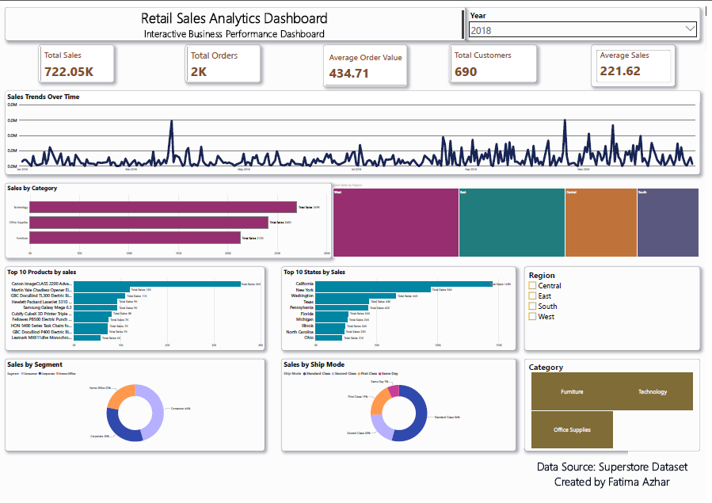

  

<h1 align="center">📊 Retail Sales Analytics Dashboard</h1>

An end-to-end Data Analytics project using <strong>Python</strong>, <strong>MySQL</strong>, and <strong>Power BI</strong> to analyze retail sales performance and generate actionable business insights.

---

# 📊 Retail Sales Analytics Dashboard

## 📌 Project Overview

This project demonstrates an end-to-end Retail Sales Analytics workflow using Python, SQL, and Power BI. The goal was to clean, analyze, and visualize retail sales data to uncover meaningful business insights and support data-driven decision-making.

---

## 🛠️ Tools & Technologies

- Python (Pandas)
- MySQL
- Power BI
- DAX
- Microsoft Excel

---

## 📂 Project Workflow

### 1️⃣ Data Cleaning (Python)
- Cleaned and transformed raw retail sales data.
- Handled missing values and inconsistent formats.
- Fixed mixed date formats.
- Exported a clean dataset for analysis.

### 2️⃣ SQL Analysis
- Imported the cleaned dataset into MySQL.
- Performed analytical SQL queries.
- Extracted business insights.

### 3️⃣ Power BI Dashboard
Designed an interactive dashboard featuring:

- Total Sales
- Total Orders
- Total Customers
- Average Sales
- Average Order Value
- Sales Trend Over Time
- Sales by Category
- Sales by Region
- Top 10 Products
- Top 10 States
- Customer Segment Analysis
- Ship Mode Analysis

---

## 📷 Dashboard Preview

---

## 💡 Key Insights

- Technology generated the highest sales.
- Regional performance varies significantly across the four regions.
- A small number of products contribute a large share of total sales.
- Consumer is the largest customer segment.
- Sales trends fluctuate over time with noticeable seasonal peaks.

---

## 🎯 Skills Demonstrated

- Data Cleaning
- Data Wrangling
- SQL
- Data Visualization
- Dashboard Design
- Business Intelligence
- DAX
- Exploratory Data Analysis (EDA)

---

## 👩‍💻 Author

**Fatima Azhar**

Aspiring Data Analyst | Business Intelligence Enthusiast
